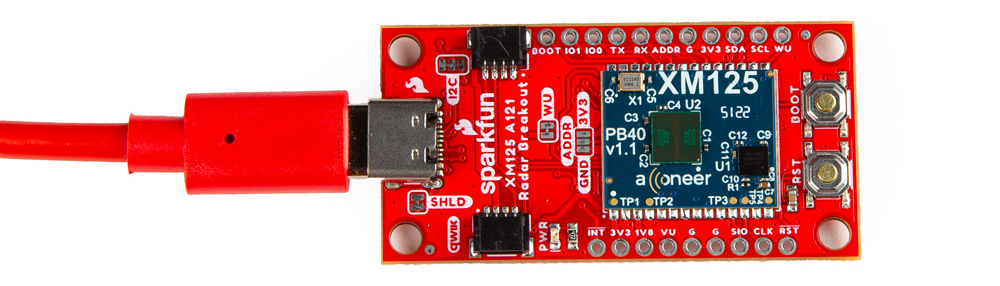

Before you are able to use the Exploration Tool with the XM125, you will also need to flash the appropriate firmware (e.g. the **acc_exploration_server_a121.bin**). You can use the [instructions outlined earlier with the STM32CubeProgrammer](../flashing_firmware_xm125). You can also use Acconeer's Exploration Tool to flash firmware as well.

### Installing XM125 Firmware with the Exploration Tool

As explained earlier, each application requires a specific firmware to be flashed on the XM125. By default, the presence detection firmware (i.e. _i2c_presence_detector.bin_) is loaded on the SparkFun Pulsed Coherent Radar Sensor - Acconeer XM125 (Qwiic). For users that are interested in loading other firmware, we recommend heading over Acconeer's developer site to download the latest firmware. At the time of writing, this should be located under **Developer Tools & Support** > **A121 Docs & Software** > **XM125 / XE125** > **Acconeer XM125 A121 (SDK for XM125)**.

<a href="https://developer.acconeer.com/home/a121-docs-software/xm125-xe125/" class="md-button">Download the XM125 Firmware!</a>

!!! note
    You will need an account to download the firmware.  Make sure to register for an account and sign in to download the XM125 firmware.

### Flashing Firmware

Open the Acconeer Exploration Tool. You'll be presented with two options. For the scope of this tutorial, you will select the **A121**.

  <table>
    <tr style="vertical-align:middle;">
     <td style="text-align: center; vertical-align: middle; border: solid 1px #cccccc;"></td>
    </tr>
  </table>

Connect a USB between the SparkFun Pulsed Coherent Radar Sensor - Acconeer XM125 (Qwiic) and your computer.

  <table>
    <tr style="vertical-align:middle;">
     <td style="text-align: center; vertical-align: middle; border: solid 1px #cccccc;"></td>
    </tr>
  </table>

Select the **Flash** tab from the side navigation bar.  

  <table>
    <tr style="vertical-align:middle;">
     <td style="text-align: center; vertical-align: middle; border: solid 1px #cccccc;"></td>
    </tr>
  </table>

Select the firmware to flash to the SparkFun Pulsed Coherent Radar Sensor - Acconeer XM125 by clicking on the **Browse** button. In this case, you will need to head to: .. > **acconeer_xm125_a121-v1_5_0** > **xm125** > **out**. The version number will change depending on when you downloaded the firmware. Select **acc_exploration_server_a121.bin**.

  <table>
    <tr style="vertical-align:middle;">
     <td style="text-align: center; vertical-align: middle; border: solid 1px #cccccc;"></td>
    </tr>
  </table>

Select **Serial**. Then select the COM port that the SparkFun Pulsed Coherent Radar Sensor - Acconeer XM125 enumerated to. In this case it was **COM22 ()**. The COM port with the parenthesis will most likely be the COM port. From the drop down menu, select **XM125**.

  <table>
    <tr style="vertical-align:middle;">
     <td style="text-align: center; vertical-align: middle; border: solid 1px #cccccc;"></td>
    </tr>
  </table>

You will need to set the XM125 in bootloader mode.

- Press and hold the BOOT button.
- Press the RST button while still holding down the BOOT button.
- Release the RST button.
- After a short moment, release the BOOT button.

  <table>
    <tr style="vertical-align:middle;">
     <td style="text-align: center; vertical-align: middle; border: solid 1px #cccccc;"></td>
     <td style="text-align: center; vertical-align: middle; border: solid 1px #cccccc;"></td>
     <td style="text-align: center; vertical-align: middle; border: solid 1px #cccccc;"></td>
     <td style="text-align: center; vertical-align: middle; border: solid 1px #cccccc;"></td>
   </tr>
  </table>

!!! note
    You will want to wait a short moment before releasing the BOOT button to give the XM125 a moment to recognize that the BOOT button is being held low. Releasing the RST button too fast after the XM125 resets may prevent the module from properly entering bootloader mode.

Click the **Flash** button to flash the firmware. After a few seconds, you should get a message: "Flashing done!"

  <table>
    <tr style="vertical-align:middle;">
     <td style="text-align: center; vertical-align: middle; border: solid 1px #cccccc;"></td>
    </tr>
  </table>

### Getting Started with the Exploration Tool

Click on **Stream** from the side navigation bar. Select **Serial**. Then select the COM port that the board enumerated to. In this case, it was **COM22 ()** just like when the board was flashed earlier with the Exploration Tool.

  <table>
    <tr style="vertical-align:middle;">
     <td style="text-align: center; vertical-align: middle; border: solid 1px #cccccc;"></td>
    </tr>
  </table>

Configure the COM port by clicking on the gear between the COM port and Connect button. A small window will pop up to configure the COM port. Make sure to deselect the **Auto-connect** and manually enter the baud rate: **115200**. You may get an error when starting a measurements. Close the window by clicking the **X** button. Then click the **Connect** button.

  <table>
    <tr style="vertical-align:middle;">
     <td style="text-align: center; vertical-align: middle; border: solid 1px #cccccc;"></td>
    </tr>
  </table>

There are several demos available with the Acconeer Exploration Tool. Let&apos;s check out the presence detector example. Click on the **Presence detector** button. Then click on the **Start Measurement** button. Try placing your hand over the sensor and then moving it away

  <table>
    <tr style="vertical-align:middle;">
     <td style="text-align: center; vertical-align: middle; border: solid 1px #cccccc;"></td>
     <td style="text-align: center; vertical-align: middle; border: solid 1px #cccccc;"></td>
    </tr>
  </table>

You should see the presence distance values increase in the plot. From the history, I had moved my hand quickly away from the sensor resulting in the intra-presence score to increase. Then I moved it back and slowly moved it away resulting in the inter-presence score to increase. The  presence distance values would also be displayed in the bottom plot.

  <table>
    <tr style="vertical-align:middle;">
     <td style="text-align: center; vertical-align: middle; border: solid 1px #cccccc;"></td>
    </tr>
  </table>

Let&apos;s check out the distance detector example. Click on the **Distance detector** button. Then click on the **Start Measurement** button. Placing my hand over the sensor and then moving it away, you should see the distance values increase in the plot. This was indicated by the four orange dots on the bottom graph.

  <table>
    <tr style="vertical-align:middle;">
     <td style="text-align: center; vertical-align: middle; border: solid 1px #cccccc;"></td>
    </tr>
  </table>

Try checking out Acconeer's documentation for the Exploration tool and adjusting each value for your application. Or even place the sensor behind a wooden door or glass window to see if the sensor can detect your presence or distance from the sensor. There are also applications to measure breathing rate, detect parked cars, adjust the range of the presence detection into zones, measure tank levels, and measure speed!

<a href="https://docs.acconeer.com/en/latest/exploration_tool/algo/a121/index.html" class="md-button">Click Here to Browse Acconeer's Documentation for the Exploration Tool</a>

