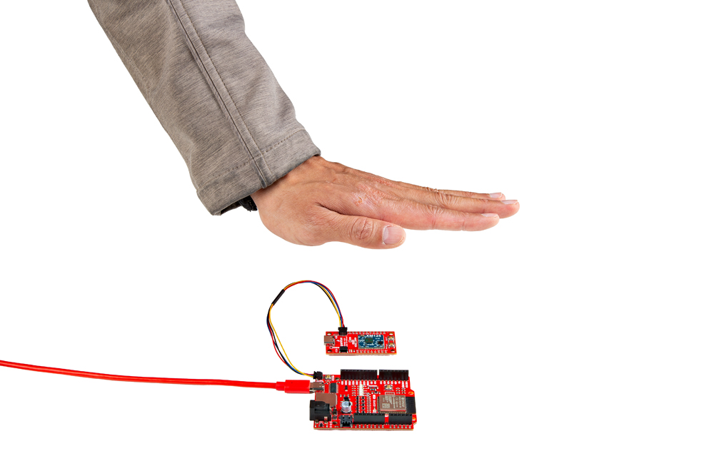
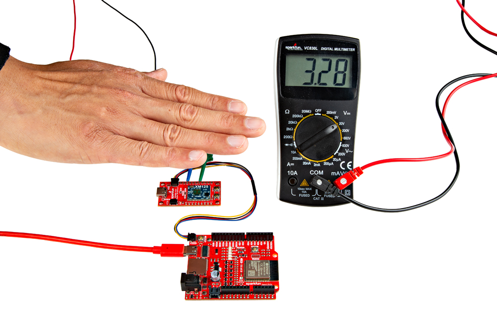

Now that we have our library and board add-on installed, we can get start experimenting with the breakout board. For the scope of this tutorial, we will highlight one of the examples to get started. From there we will be able to build our own custom code to integrate the development board into a project.

## I2C Presence Detection Arduino Examples

The following examples will go over the presence detection examples over I2C. By default, the firmware for the I2C presence detection will be loaded on the SparkFun Pulsed Coherent Radar Sensor. If you decide you uploaded a different firmware to the XM125 and decide to use the Presence Detection Arduino Examples, make sure to follow the [steps to reflash the **i2c_presence_detector.bin** back on the module](../installing_xm125_firmware).

### Example 1: Presence Basic Readings

This example reads the output from the XM125 when the presence sensing firmware is loaded to the module. Once the sensor is initialized, the example outputs the presence distance values (in millimeters) to a Serial Terminal. Head to the examples in the folder (located in **File** > **Examples** > **SparkFun XM125 Arduino Library** > **Example01PresenceBasicReadings**).

If you have not already, select your Board (in this case the **SparkFun ESP32 IoT RedBoard**), and associated COM port. Upload the code to the board and set the [Arduino Serial Monitor](https://learn.sparkfun.com/tutorials/terminal-basics/all#arduino-serial-monitor-windows-mac-linux) to **115200** baud.

  <table>
    <tr style="vertical-align:middle;">
     <td style="text-align: center; vertical-align: middle; border: solid 1px #cccccc;></td>
    </tr>
  </table>

You should see an output similar to the image above. In this case, I placed my hand in front of the sensor and moved it away.

  <table>
    <tr style="vertical-align:middle;">
     <td style="text-align: center; vertical-align: middle; border: solid 1px #cccccc;></td>
     <td style="text-align: center; vertical-align: middle; border: solid 1px #cccccc;></td>
    </tr>
  </table>

Try placing something like a piece of cardboard in front of the sensor to see if the XM125 can still detect your presence. Or aim the sensor facing down toward a table and wave your arm or leg under the table to see if it can sense your movement. [Some materials are semi-transparent to 60GHz signals](https://docs.acconeer.com/en/latest/handbook/radar_principles.html#). Thus, it is possible to [detect reflecting objects behind a material such as an enclosure](https://docs.acconeer.com/en/latest/handbook/physical_integration.html), or sensing other objects behind walls or clothing!

  <table>
    <tr style="vertical-align:middle;">
     <td style="text-align: center; vertical-align: middle; border: solid 1px #cccccc;></td>
    </tr>
  </table>

!!! note
    The XM125 is set to a minimum range of 30mm. You can adjust the range in Example 5: Presence Advanced Settings.

### Example 2: Presence GPIO0 Usage

This example reads the output from the XM125 when the presence sensing firmware is loaded to the module. Once the sensor is initialized, the example outputs the presence distance values (in millimeters) to a Serial Terminal similar to the first example. However, the SparkFun Pulsed Coherent Radar Sensor's GPIO0 will also be set HIGH whenever there is a presence detected. Head to the examples in the folder (located in **File** > **Examples** > **SparkFun XM125 Arduino Library** > **Example02_PresenceGPIO0Usage**).

If you have not already, select your Board (in this case the **SparkFun ESP32 IoT RedBoard**), and associated COM port. Upload the code to the board and set the [Arduino Serial Monitor](https://learn.sparkfun.com/tutorials/terminal-basics/all#arduino-serial-monitor-windows-mac-linux) to **115200** baud.

You should see an output similar to the image below. In this case, I placed my hand in front of the sensor and moved it away just like the previous example. However, GPIO0 will also be set HIGH whenever a presence is detected.

  <table>
    <tr style="vertical-align:middle;">
     <td style="text-align: center; vertical-align: middle; border: solid 1px #cccccc;></td>
    </tr>
  </table>

Try using IC hooks or soldering to the PTHs to connect to GPIO0 and GND. Then use a multimeter to measure the pin whenever a pin is HIGH. You should see a voltage of 3.3V whenever the pin is HIGH and 0V whenever the pin is LOW.

  <table>
    <tr style="vertical-align:middle;">
     <td style="text-align: center; vertical-align: middle;"></td>
    </tr>
  </table>

!!! note
    It is recommended to have a low profile when connecting to the GPIO SparkFun Pulsed Coherent Radar Sensor to limit the amount of reflections. For users connecting IC hooks, we recommend placing them flush with the board or hooking them from the bottom side. For users soldering to the board, make sure that there are no wires protruding in front of the sensor.

### Example 3: Presence Serial Plotter

This example reads the output from the XM125 when the presence sensing firmware is loaded to the module. Once the sensor is initialized, the example outputs the presence distance values (in millimeters) to a Serial Terminal similar to the first example. However, only the values are printed for each line. This makes it easier for the Arduino Serial Plotter to graph the values. Head to the examples in the folder (located in **File** > **Examples** > **SparkFun XM125 Arduino Library** > **Example03_PresenceSerialPlotter**).

If you have not already, select your Board (in this case the **SparkFun ESP32 IoT RedBoard**), and associated COM port. Upload the code to the board. When opening the [Arduino Serial Monitor](https://learn.sparkfun.com/tutorials/terminal-basics/all#arduino-serial-monitor-windows-mac-linux) at **115200** baud, you should see only the values printed. When opening the Arduino Serial Plotter at **115200** baud, you should see the values plotted in the window.

  <table>
    <tr style="vertical-align:middle;">
     <td style="text-align: center; vertical-align: middle; border: solid 1px #cccccc;></td>
     <td style="text-align: center; vertical-align: middle; border: solid 1px #cccccc;></td>
    </tr>
  </table>

You should see an output similar to the images above. In this case, I placed my hand in front of the sensor and moved it away just like the previous example.

### Example 4: Presence Serial Advanced Readings

This example reads the output from the XM125 when the presence sensing firmware is loaded to the module. Once the sensor is initialized, the example outputs the presence distance values (in millimeters) to a Serial Terminal similar to the first example. However, you will also get the intra-presence score and the inter-presence score. The intra-presence score measures the amount of fast motion detected. The inter-presence score measures the amount of slow motion detected.

If you have not already, select your Board (in this case the **SparkFun ESP32 IoT RedBoard**), and associated COM port. Upload the code to the board. When opening the [Arduino Serial Monitor](https://learn.sparkfun.com/tutorials/terminal-basics/all#arduino-serial-monitor-windows-mac-linux) at **115200** baud, you should see the three different values printed.

  <table>
    <tr style="vertical-align:middle;">
     <td style="text-align: center; vertical-align: middle; border: solid 1px #cccccc;></td>
    </tr>
  </table>

You should see an output similar to the image above. In this case, I placed my hand in front of the sensor and moved it quickly away from the sensor. Notice that the intra-presence score was higher than the inter-presence score since my hand was moving quickly away from the sensor.

Moving my hand back in front of the sensor, let's try moving it slowly away from the sensor.

  <table>
    <tr style="vertical-align:middle;">
     <td style="text-align: center; vertical-align: middle; border: solid 1px #cccccc;></td>
    </tr>
  </table>

You should see an output similar to the image above. In this case, I placed my hand in front of the sensor and moved it slowly away from the sensor. Notice that the inter-presence score was higher this time since my hand was moving slowly away.

### Example 5: Presence Advanced Settings

This example reads the output from the XM125 when the presence sensing firmware is loaded to the module. Once the sensor is initialized, the example outputs the presence distance values (in millimeters) to a Serial Terminal similar to the first example. However, the range for presence distance sensing can be adjusted in this example.

If you have not already, select your Board (in this case the **SparkFun ESP32 IoT RedBoard**), and associated COM port. Upload the code to the board. When opening the [Arduino Serial Monitor](https://learn.sparkfun.com/tutorials/terminal-basics/all#arduino-serial-monitor-windows-mac-linux) at **115200** baud.

  <table>
    <tr style="vertical-align:middle;">
     <td style="text-align: center; vertical-align: middle; border: solid 1px #cccccc;></td>
    </tr>
  </table>

You should see an output similar to the image above. To test the presence detection range, I had a friend stand in front of the sensor before moving away. The difference between this and the first example is the ability to configure the ranges for the minimum and maximum presence distance, respectively `beginReading` and `endReading`. By default, the "start" presence distance range is set to **300mm** while the "end" presence distance range is set to **2500mm**. This example sets the range between `300` mm and `7000` mm.

Try adjusting the values `beginReading` and `endReading`. After uploading, try moving outside of the range. You will notice that the values change to a certain value when a presence is not detected.

## I2C Distance Detection Arduino Examples

The following examples will go over the distance detection examples over I2C. The firmware for the I2C distance detection is not loaded on the SparkFun Pulsed Coherent Radar Sensor. Make sure to follow the steps to flash the **i2c_distance_detector.bin** before proceeding to Arduino Example 6-9.

<a href="../installing_xm125_firmware" class="md-button">Install the XM125 Firmware!</a>

### Example 6: Distance Basic Readings

This example reads the output from the XM125 when the distance sensing firmware is loaded to the module. Once the sensor is initialized, the example outputs the distance values (in millimeters) and their estimated reflective strengths to a Serial Terminal.

If you have not already, select your Board (in this case the **SparkFun ESP32 IoT RedBoard**), and associated COM port. Upload the code to the board. When opening the [Arduino Serial Monitor](https://learn.sparkfun.com/tutorials/terminal-basics/all#arduino-serial-monitor-windows-mac-linux) at **115200** baud.

  <table>
    <tr style="vertical-align:middle;">
     <td style="text-align: center; vertical-align: middle; border: solid 1px #cccccc;></td>
    </tr>
  </table>

You should see an output similar to the image above. Similar to the presence examples, the following outputs the distance and strength of an object that is detected within the peaks. Again, a hand was placed close to the sensor before moving away from the XM125.

### Example 7: Distance Threshold Settings

This example reads the output from the XM125 when the distance sensing firmware is loaded to the module. Once the sensor is initialized, the example outputs the distance values (in millimeters) and their estimated reflective strengths to a Serial Terminal similar to example 6. The example goes further by setting the XM125's distance amplitude, strength, fixed amplitude, and sensitivity thresholds.

If you have not already, select your Board (in this case the **SparkFun ESP32 IoT RedBoard**), and associated COM port. Upload the code to the board. When opening the [Arduino Serial Monitor](https://learn.sparkfun.com/tutorials/terminal-basics/all#arduino-serial-monitor-windows-mac-linux) at **115200** baud.

  <table>
    <tr style="vertical-align:middle;">
     <td style="text-align: center; vertical-align: middle; border: solid 1px #cccccc;></td>
    </tr>
  </table>

You should see an output similar to the image above. The output will be similar to the example 6.

### Example 8: Distance Serial Plotter

This example reads the output from the XM125 when the distance sensing firmware is loaded to the module. Once the sensor is initialized, the example outputs the distance values (in millimeters) from peak 0 and peak 1 for the Arduino Serial Plotter.

If you have not already, select your Board (in this case the **SparkFun ESP32 IoT RedBoard**), and associated COM port. Upload the code to the board. When opening the [Arduino Serial Monitor](https://learn.sparkfun.com/tutorials/terminal-basics/all#arduino-serial-monitor-windows-mac-linux) at **115200** baud. You should see an output similar to the image below. In this case, the XM125 detected a mesh chair with a coat.

  <table>
    <tr style="vertical-align:middle;">
     <td style="text-align: center; vertical-align: middle; border: solid 1px #cccccc;></td>
     <td style="text-align: center; vertical-align: middle; border: solid 1px #cccccc;></td>
    </tr>
  </table>

Walking behind the chair, the XM125 was able to detect both the chair and when I was standing behind it.

  <table>
    <tr style="vertical-align:middle;">
     <td style="text-align: center; vertical-align: middle; border: solid 1px #cccccc;></td>
     <td style="text-align: center; vertical-align: middle; border: solid 1px #cccccc;></td>
    </tr>
  </table>

!!! note
    For those that are interested in viewing more than `distancePeak0` and `distancePeak1`, you will need to create the distance variables, read the PeakX distance, and add a `Serial.print();` for each distance variable similar to Arduino example 6. Make sure to also add a comma between each distance value so that the comma separated value (CSV) can be graphed on the Arduino Serial Plotter. Make sure to also have the last distance value printed as `Serial.println();`

### Example 9: Distance Advanced Settings

This example reads the output from the XM125 when the distance sensing firmware is loaded to the module. Once the sensor is initialized, the example outputs the distance values (in millimeters) and their estimated reflective strengths to a Serial Terminal similar to example 6.

If you have not already, select your Board (in this case the **SparkFun ESP32 IoT RedBoard**), and associated COM port. Upload the code to the board. When opening the [Arduino Serial Monitor](https://learn.sparkfun.com/tutorials/terminal-basics/all#arduino-serial-monitor-windows-mac-linux) at **115200** baud. You should see an output similar to the image below.

  <table>
    <tr style="vertical-align:middle;">
     <td style="text-align: center; vertical-align: middle; border: solid 1px #cccccc;></td>
    </tr>
  </table>

The difference between this and the example 6 is the ability to configure the ranges for the minimum and maximum distance distance, respectively `beginReading` and `endReading`. By default, the "start" presence distance range is set to **300mm** while the "end" presence distance range is set to **2500mm**. This example sets the range between `300` mm and `7000` mm.
