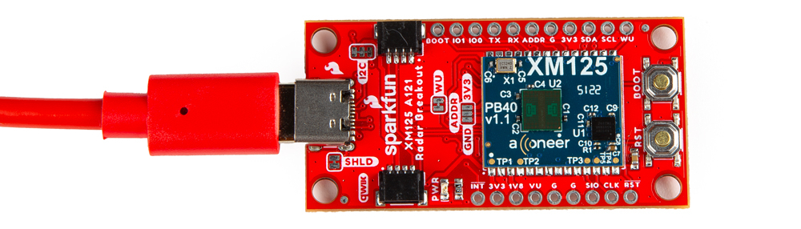
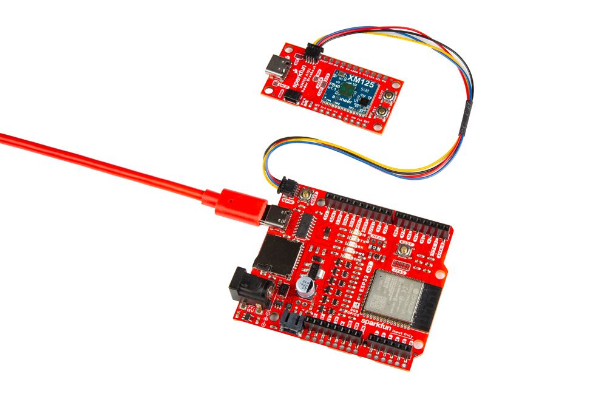
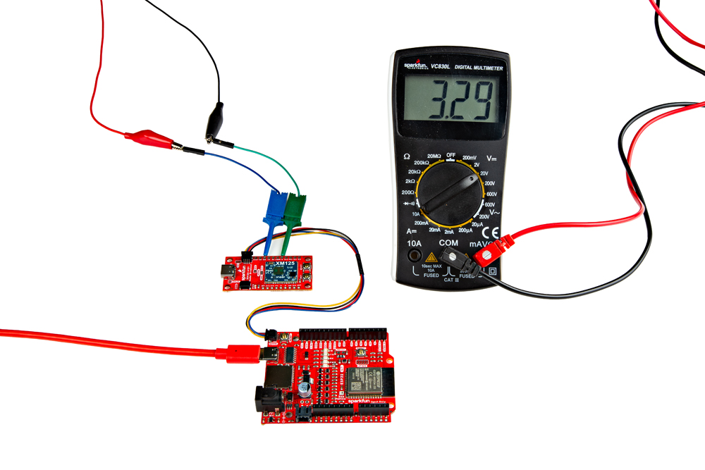
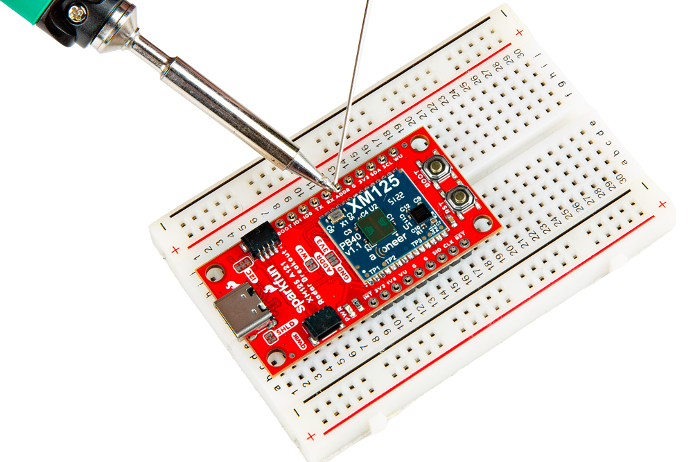

In this section, we'll go over how to connect to the SparkFun Pulsed Coherent Radar Sensor - Acconeer XM125 (Qwiic). Depending on your application, you can connect the board directly to your computer.  For embedded application, you can also connect the board to the IoT RedBoard - ESP32.

### USB to SparkFun Pulsed Coherent Radar Sensor

For users that simply want to connect to the board via USB, you will just need to insert a USB C cable into the USB connector. Then connect the other end to your computer's USB port.

  <table>
    <tr style="vertical-align:middle;">
     <td style="text-align: center; vertical-align: middle;"></td>
    </tr>
  </table>

### Connecting a USB and Qwiic Cable

!!! note
    We recommend using the IoT RedBoard - ESP32 for the scope of this tutorial.

For this example, we will use the IoT RedBoard - ESP32 and its associated cable. Connecting the boards with a Qwiic cable is very simple. Plug a Qwiic cable between the RedBoard IoT and the SparkFun Pulsed Coherent Radar Sensor. If you're going to be soldering to the through hole pins, then just attach lines to power, ground, and the I2C data lines to the microcontroller of your choice. To power and program the IoT RedBoard - ESP32, users will just need to insert the Type C side of the cable to the development board. The other end will connect to a computer's USB port.

  <table>
    <tr style="vertical-align:middle;">
     <td style="text-align: center; vertical-align: middle;"></td>
    </tr>
  </table>

!!! note
    For users that are testing the XM125 to detect objects from across the room, you may want to consider using a [3rd hand](https://www.sparkfun.com/products/19944) to hold the board up.

### Connecting via PTH

For temporary connections to the PTHs, you could use IC hooks to test out the pins. However, you'll need to solder headers or wires of your choice to the board for a secure connection. You can choose between a combination of [header pins and jumper wires](https://learn.sparkfun.com/tutorials/how-to-solder-through-hole-soldering/all), or [stripping wire and soldering the wire](https://learn.sparkfun.com/tutorials/working-with-wire/all) directly to the board.

-   <a href="https://learn.sparkfun.com/tutorials/how-to-solder-through-hole-soldering/all">
      <figure markdown>
        
      </figure>
    </a>

    ---

    <a href="https://learn.sparkfun.com/tutorials/how-to-solder-through-hole-soldering/all">
      <b>How to Solder: Through Hole Soldering</b>
    </a>
<!-- ----------WHITE SPACE BETWEEN GRID CARDS---------- -->

-   <a href="https://learn.sparkfun.com/tutorials/working-with-wire/all">
      <figure markdown>
        
      </figure>
    </a>

    ---

    <a href="https://learn.sparkfun.com/tutorials/working-with-wire/all">
      <b>Working with Wire</b>
    </a>
<!-- ----------WHITE SPACE BETWEEN GRID CARDS---------- -->

It is recommended to have a low profile when connecting headers or wires to the SparkFun Pulsed Coherent Radar Sensor to limit the amount of reflections. For users connecting IC hooks, we recommend placing them flush with the board or hooking them from the bottom side. Below is an example of the IC hooks connected from the sides when measuring GPIO0.

  <table>
    <tr style="vertical-align:middle;">
     <td style="text-align: center; vertical-align: middle;"></td>
    </tr>
  </table>

For users soldering to the board, make sure that there are no headers or wires protruding in front of the sensor. The image below shows straight header pins being soldered to the PTHs. For users that are using the breadboard, we recommend using [jumper wires](https://www.sparkfun.com/products/124) that are close to the board rather than having them protruding in front of the sensor.

  <table>
    <tr style="vertical-align:middle;">
     <td style="text-align: center; vertical-align: middle;"></td>
    </tr>
  </table>

