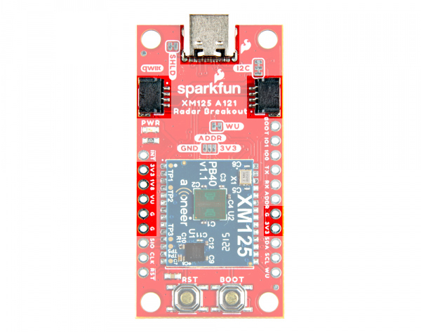
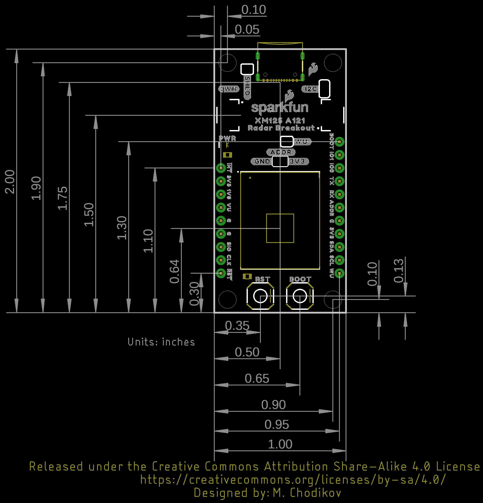

In this section, we will highlight the hardware and pins that are broken out on the SparkFun Pulsed Coherent Radar Sensor - XM125 (Qwiic). For more information, check out our [Resources and Going Further](../resources/) for the XM125 Module and the A121 Pulsed Coherent Radar Sensor.

  <table>
    <tr style="vertical-align:middle;">
     <td style="text-align: center; vertical-align: middle; border: solid 1px #cccccc;"></td>
     <td style="text-align: center; vertical-align: middle; border: solid 1px #cccccc;"></td>
    </tr>
    <tr style="vertical-align:middle;">
     <td style="text-align: center; vertical-align: middle; border: solid 1px #cccccc;"><i>Top View</i></td>
     <td style="text-align: center; vertical-align: middle; border: solid 1px #cccccc;"><i>Bottom View</i></td>
    </tr>
  </table>

### XM125 Module

The board breaks out the Acconeer XM125 module with some application circuits.

  <table>
    <tr style="vertical-align:middle;">
     <td style="text-align: center; vertical-align: middle; border: solid 1px #cccccc;"></td>
    </tr>
    <tr style="vertical-align:middle;">
     <td style="text-align: center; vertical-align: middle; border: solid 1px #cccccc;"><i>Acconeer XM125 Module</i></td>
    </tr>
  </table>

Below are a few specifications from the datasheet.

* Acconeer XM125 Module
    * A121
        * 60GHz Pulsed Coherent Radar (PCR)
        * Integrated Baseband, RF Front-End and Antenna in Package
        * Detect Distance, Speed, Motion, and Objects up to 20 Meters Away
        * Millimeter Precise Readings
        * Low Power Consumption
    * STMicroelectronics STM32L431CBY6
        * 32-bit Arm&reg; Cortex&reg; M4 MCU
        * Clock Speed: 80 MHz
        * Flash: 128kB
        * RAM: 68kB

For users using the XM125 module to detect objects through a material (especially for those placing the board in an enclosure), you may want to check out [Acconeer's Hardware and Physical Integration Guideline PCR Sensors A111 & A121 User Guide](../assets/component_documentation/Hardware-integration-guideline.pdf).

<a href="../assets/component_documentation/Hardware-integration-guideline.pdf" class="md-button">Acconeer's Hardware and Physical Integration Guideline PCR Sensors A111 & A121 User Guide</a>

!!! note
    Due to the higher frequencies, pulsed coherent radar sensors may be regulated in certain countries. Be sure to check local regulations before use.

### Power

There are a variety of power and power-related nets broken out to the USB connector, Qwiic connectors and plated through holes. **5V** power from the USB C Connector or PTH is regulated down to _3.3V_ with the AP2112K 3.3V/600mA voltage regulator. The voltage is further regulated down to _1.8V_ with the RT9080 1.8V/600mA voltage regulator. The logic levels for the XM125 is **3.3V** for the I/O pins.

* **VU** / **VUSB** &mdash; Power from the USB C connector's VBUS provides power to the V_BUS. The V_USB net is also connected to the edge PTH pin labeled as **VU** on the top of the board and **VUSB** on the bottom of the board. This is also connected to the input of the 3.3V voltage regulator. Make sure that power you provide to this pin does not exceed 6 volts.
* **3V3** &mdash; This connects to the 3.3V net. Both sides of the board includes a 3.3V pin (labeled as 3V3). The output of the AP2112K 3.3V voltage regulator and input of the RT9080 1.8V voltage regulator are connected to this net. 3.3V net can also be accessed through one of the Qwiic connector's pins. You should only provide a clean 3.3V power signal to those pins.
* **G** / **GND** &mdash; Of course, is the common, ground voltage (0V reference) for the system.

  <table>
    <tr style="vertical-align:middle;">
     <td style="text-align: center; vertical-align: middle; border: solid 1px #cccccc;"></td>
     <td style="text-align: center; vertical-align: middle; border: solid 1px #cccccc;"></td>
    </tr>
    <tr style="vertical-align:middle;">
     <td style="text-align: center; vertical-align: middle; border: solid 1px #cccccc;"><i>Power from USB, Qwiic, and PTHs  (Top View)</i></td>
     <td style="text-align: center; vertical-align: middle; border: solid 1px #cccccc;"><i>Power from PTHs  (Bottom View)</i></td>
    </tr>
  </table>

### CH340C USB-to-Serial Converter

ON the back of the board is a built-in CH340 USB-to-serial converter to connect the XM125's primary UART to a computer's USB port. This is useful for users viewing data, configuring the XM125, or updating firmware. ESD protection diodes are included between the USB C and the CH340C's USB data lines.

  <table>
    <tr style="vertical-align:middle;">
     <td style="text-align: center; vertical-align: middle; border: solid 1px #cccccc;"></td>
    </tr>
    <tr style="vertical-align:middle;">
     <td style="text-align: center; vertical-align: middle; border: solid 1px #cccccc;"><i>TVS Diodes, and CH340 Highlighted</i></td>
    </tr>
  </table>

### UARTs

The board has two UARTs. The primary UART (not highlighted in the image below) is connected internally to the CH340C USB-to-Serial converter. There is also a debugging UART that is broken out on the edge of the board.

* **TX** / **DEBUG_TX** &mdash; TX out for debugging
* **RX** / **DEBUG_RX** &mdash; RX in for debugging

  <table>
    <tr style="vertical-align:middle;">
     <td style="text-align: center; vertical-align: middle; border: solid 1px #cccccc;"></td>
     <td style="text-align: center; vertical-align: middle; border: solid 1px #cccccc;"></td>
    </tr>
    <tr style="vertical-align:middle;">
     <td style="text-align: center; vertical-align: middle; border: solid 1px #cccccc;"><i>Debugging UART Pins  (Top View)</i></td>
     <td style="text-align: center; vertical-align: middle; border: solid 1px #cccccc;"><i>Debugging UART Pins  (Bottom View)</i></td>
    </tr>
  </table>

!!! note
    To enable or disable UART logging, you will need to call the function after resetting the XM125 in the `setup()` function (i.e. `radarSensor.setPresenceCommand(SFE_XM125_PRESENCE_RESET_MODULE);`). Make sure to call the `distanceEnableUartLogs()`, `distanceDisableUartLogs()`, `presenceEnableUartLogs()`, or `presenceDisableUartLogs()` function before applying the configuration using the `radarSensor.setPresenceCommand(SFE_XM125_PRESENCE_APPLY_CONFIGURATION)`. The functions correspond the firmware for the presence and distance detection firmware, respectively.

### Qwiic and I2C

There are two PTHs labeled **SDA** and **SCL** on one side of the board. These are the I2C data and clock lines and are connected to two 2.2k&ohm; pull-up resistors. We also conveniently added a GND and 3.3V pin on one side should you decide to daisy chain additional I2C devices to the PTH. Similarly, you can use either of the Qwiic connectors to provide power and send data through I2C. The [Qwiic ecosystem](https://www.sparkfun.com/qwiic) is made for fast prototyping by removing the need for soldering. All you need to do is plug a Qwiic cable into the Qwiic connector and voila!

* **SDA** &mdash; I2C data
* **SCL** &mdash; I2C clock

  <table>
    <tr style="vertical-align:middle;">
     <td style="text-align: center; vertical-align: middle; border: solid 1px #cccccc;"></td>
     <td style="text-align: center; vertical-align: middle; border: solid 1px #cccccc;"></td>
    </tr>
    <tr style="vertical-align:middle;">
     <td style="text-align: center; vertical-align: middle; border: solid 1px #cccccc;"><i>I2C and Qwiic Connectors  (Top View)</i></td>
     <td style="text-align: center; vertical-align: middle; border: solid 1px #cccccc;"><i>I2C Pins  (Bottom View)</i></td>
    </tr>
  </table>

The default address of the XM125 is set to **0x52**.

### Reset and Boot Buttons

We included two low profile buttons for reset and bootloader.

* **RST** / <b>RST</b> / <b>RESET</b> &mdash; Pressing down on the reset button will connect the pin to ground and reset the XM125. This is also broken out to a PTH on the edge of the board.
* **BOOT** / <b>GPIO2/BOOT</b> &mdash; Pressing down on the boot button will connect the pin to 3.3V. This will put it into bootloader mode when the XM125 is starting up. This is also broken out to a PTH on the edge of the board.  The alternative function of this pin is also used as a general purpose I/O. This can be configurable for different functions. At the time of writing, GPIO2 is not functional with the current firmware. The functionality is to be implemented in the future.

  <table>
    <tr style="vertical-align:middle;">
     <td style="text-align: center; vertical-align: middle; border: solid 1px #cccccc;"></td>
     <td style="text-align: center; vertical-align: middle; border: solid 1px #cccccc;"></td>
    </tr>
    <tr style="vertical-align:middle;">
     <td style="text-align: center; vertical-align: middle; border: solid 1px #cccccc;"><i>Reset and Boot Pins and Buttons  (Top View)</i></td>
     <td style="text-align: center; vertical-align: middle; border: solid 1px #cccccc;"><i>Reset and Boot Pins  (Bottom View)</i></td>
    </tr>
  </table>

!!! note
    We included low profile buttons on the board to reduce the amount of reflections when using the XM125.

### SWD Pins

The edge of the board includes the SWDIO and SWDCLK programming pins. On the back of the board, there is a 2x5 SWD footprint to solder a [SMD 2x5 header](https://www.sparkfun.com/products/22890). This is available for users that want to debug and flash the XM125's STM32L431 using a programmer.

* **SWDIO** &mdash; Serial wire debug I/O.
* **SWDCLK** &mdash; Serial wire debug clock.

  <table>
    <tr style="vertical-align:middle;">
     <td style="text-align: center; vertical-align: middle; border: solid 1px #cccccc;"></td>
     <td style="text-align: center; vertical-align: middle; border: solid 1px #cccccc;"></td>
    </tr>
    <tr style="vertical-align:middle;">
     <td style="text-align: center; vertical-align: middle; border: solid 1px #cccccc;"><i>SWD Pins  (Top View)</i></td>
     <td style="text-align: center; vertical-align: middle; border: solid 1px #cccccc;"><i>SWD Pins  (Bottom View)</i></td>
    </tr>
  </table>

### Broken Out Pins

Below are the other pins broken out:

* **INT** &mdash; Interrupt output pin. This pin could be used to send an interrupt from the XM125 to a host microcontroller.
* **GPIO1** &mdash; General purpose I/O. This can be configurable for different functions. At the time of writing, GPIO1 are not functional with the current firmware. The functionality is to be implemented in the future.
* **GPIO0** &mdash; General purpose I/O. This can be configurable for different functions. This pin is currently only functional with the presence detector firmware, specifically the _i2c_presence_detector.bin_ .
* **I2C_ADDR** &mdash; This pin is used to configure the I2C Address. This is also connected to the three way jumper labeled as ADDR. The functionality is to be implemented in the future.
* **WU** / **WAKE_UP** &mdash; This pin is used to set the XM125 in low power mode. This is connected to the WU jumper and 3.3V. To toggle low power mode using a microcotrller, you will need to cut the WU jumper and solder the pin to a microcontroller's GPIO pin. Setting the pin high will wake the XM125 up from low power mode.

  <table>
    <tr style="vertical-align:middle;">
     <td style="text-align: center; vertical-align: middle; border: solid 1px #cccccc;"></td>
     <td style="text-align: center; vertical-align: middle; border: solid 1px #cccccc;"></td>
    </tr>
    <tr style="vertical-align:middle;">
     <td style="text-align: center; vertical-align: middle; border: solid 1px #cccccc;"><i>SWD Pins  (Top View)</i></td>
     <td style="text-align: center; vertical-align: middle; border: solid 1px #cccccc;"><i>SWD Pins  (Bottom View)</i></td>
    </tr>
  </table>

### LED

The board includes the following status LED as indicated in the image below.

* **PWR** &mdash; Indicates when there is 3.3V available.

  <table>
    <tr style="vertical-align:middle;">
     <td style="text-align: center; vertical-align: middle; border: solid 1px #cccccc;"></td>
    </tr>
    <tr style="vertical-align:middle;">
     <td style="text-align: center; vertical-align: middle; border: solid 1px #cccccc;"><i>LED Highlighted</i></td>
    </tr>
  </table>

### Jumpers

!!!note
    If this is your first time working with jumpers, check out the [How to Work with Jumper Pads and PCB Traces](https://learn.sparkfun.com/tutorials/how-to-work-with-jumper-pads-and-pcb-traces/all) tutorial for more information.

There are jumper pads on the top and bottom of the board.

* **SHLD** &mdash; This jumper is located on the top of the board and connects the USB Type C connector's shield pin to GND. By default, this is closed. Cut this to isolate the USB Type C connector's shield pin.
* **I2C** &mdash; This three way jumper is located on the top of the board and labeled **I2C**. By default, this three way jumper is closed. This jumper is connected to two pull-up resistors on the I2C data and clock lines. For users that have multiple Qwiic-enabled devices with pull-up resistors enabled, the parallel equivalent resistance will create too strong of a pull-up for the bus to operate correctly. As a general rule of thumb, [disable all but one pair of pull-up resistors](https://learn.sparkfun.com/tutorials/i2c/all#i2c-at-the-hardware-level) if multiple devices are connected to the bus.
* **WU** &mdash; This jumper is located on the top of the board. By default, this jumper is closed. This jumper connects 3.3V with the wake up pin. Cut this trace to enter low power mode.
* **ADDR** &mdash; This three way jumper is located on the top of the board and labeled **ADDR**. By default, this three-way jumper is open. This jumper is used to adjust the I2C address of the XM125 module. Adding a solder blob between the center and the pad on either side will change the default address. The functionality is to be implemented in the future.
* **LED** &mdash; This jumper is located on the bottom of the board and connects the LED to 3.3V. Cut this jumper to disable the LED.

  <table>
    <tr style="vertical-align:middle;">
     <td style="text-align: center; vertical-align: middle; border: solid 1px #cccccc;"></td>
     <td style="text-align: center; vertical-align: middle; border: solid 1px #cccccc;"></td>
    </tr>
    <tr style="vertical-align:middle;">
     <td style="text-align: center; vertical-align: middle; border: solid 1px #cccccc;"><i>MEAS PTH Highlighted - Top View</i></td>
     <td style="text-align: center; vertical-align: middle; border: solid 1px #cccccc;"><i>Jumpers Highlighted Highlighted - Bottom View</i></td>
    </tr>
  </table>

### Board Dimensions

The board is 1.0" x 2.0" (25.4mm x 50.8mm). There are 4x mounting holes by each corner of the board for 4-40 screws and standoffs.

  <table>
    <tr style="vertical-align:middle;">
     <td style="text-align: center; vertical-align: middle; border: solid 1px #cccccc;"></td>
    </tr>
    <tr style="vertical-align:middle;">
     <td style="text-align: center; vertical-align: middle; border: solid 1px #cccccc;"><i>Board Dimensions</i></td>
    </tr>
  </table>

