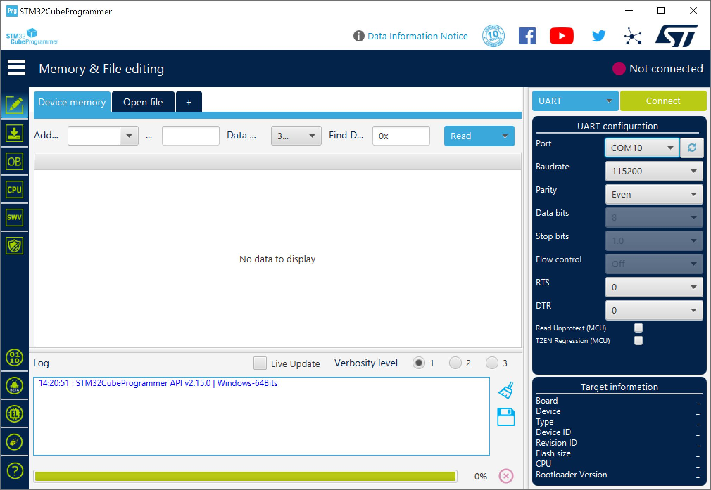
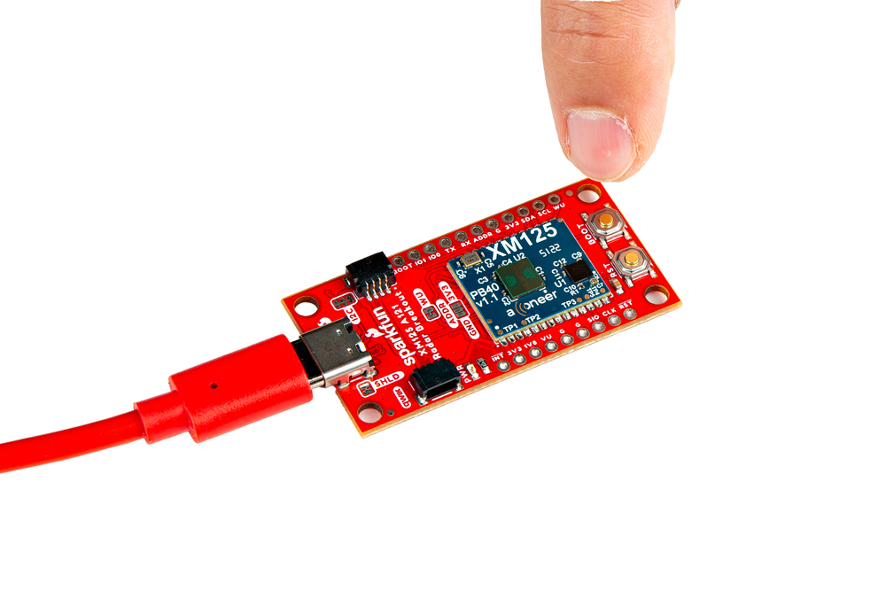

The XM125 uses different firmware for different applications. You will need to program the XM125 when using presence detection or distance detection. For users using the Arduino examples for presence detection, you can skip this section. Otherwise, follow the steps to flash the firmware for the distance detection or for those that are re-flashing the presence detection firmware.

### Installing STM32CubeProgrammer

Head over to STMicroelectronics, click on the **Get Software** button. This will scroll down to the bottom of the page. Select the STM32CubeProgrammer for your OS to install. After downloading, unzip the the STM32CubeProgrammer and click on the installer. Follow the prompts to install the software.

<a href="https://www.st.com/en/development-tools/stm32cubeprog.html" class="md-button">Download the STM32Cube Programmer Here!</a>

### Downloading Firmware

!!! note
    Arduino examples 1-5 with the default firmware (i.e. _i2c_presence_detector.bin_) that is loaded on the SparkFun Pulsed Coherent Radar Sensor - Acconeer XM125 (Qwiic). For Arduino examples 6-9, you will need to load the distance detection firmware (i.e. _i2c_distance_detector.bin_)

Each application requires a specific firmware to be flashed on the XM125. By default, the presence detection firmware (i.e. _i2c_presence_detector.bin_) is loaded on the SparkFun Pulsed Coherent Radar Sensor - Acconeer XM125 (Qwiic). For users that are interested in loading other firmware, we recommend heading over Acconeer's developer site to download the latest firmware. At the time of writing, this should be located under **Developer Tools & Support** > **A121 Docs & Software** > **XM125 / XE125**> **Acconeer XM125 A121 (SDK for XM125)**.

<a href="https://developer.acconeer.com/home/a121-docs-software/xm125-xe125/" class="md-button">Download the XM125 Firmware!</a>

!!! note
    You will need an account to download the firmware.  Make sure to register for an account and sign in to download the XM125 firmware.

### Flashing Firmware

Open the STM32CubeProgrammer software.

  <table>
    <tr style="vertical-align:middle;">
     <td style="text-align: center; vertical-align: middle;"></td>
    </tr>
  </table>

Connect a USB between the SparkFun Pulsed Coherent Radar Sensor - Acconeer XM125 (Qwiic) and your computer.

  <table>
    <tr style="vertical-align:middle;">
     <td style="text-align: center; vertical-align: middle;"></td>
    </tr>
  </table>

You will need to set the XM125 in bootloader mode.

- Press and hold the BOOT button.
- Press the RST button while still holding down the BOOT button.
- Release the RST button.
- After a short moment, release the BOOT button.

  <table>
    <tr style="vertical-align:middle;">
     <td style="text-align: center; vertical-align: middle; border: solid 1px #cccccc;></td>
     <td style="text-align: center; vertical-align: middle; border: solid 1px #cccccc;></td>
     <td style="text-align: center; vertical-align: middle; border: solid 1px #cccccc;></td>
     <td style="text-align: center; vertical-align: middle; border: solid 1px #cccccc;></td>
   </tr>
  </table>

!!! note
    You will want to wait a short moment before releasing the BOOT button to give the XM125 a moment to recognize that the BOOT button is being held low. Releasing the RST button too fast after the XM125 resets may prevent the module from properly entering bootloader mode.

Select the COM port that the board enumerated to. In this case, it was COM10. The default UART configuration should already be set to the following:

    - 115200 baud
    - even parity
    - 8 data bits
    - 1 stop bit
    - no flow control

When ready, hit the **Connect** button.

  <table>
    <tr style="vertical-align:middle;">
     <td style="text-align: center; vertical-align: middle;"></td>
    </tr>
  </table>

Click the **Download** button (the second button on the left navigation bar). Then click on the **Browse** button to select the firmware that you would like to flash to the board.

  <table>
    <tr style="vertical-align:middle;">
     <td style="text-align: center; vertical-align: middle;"></td>
    </tr>
  </table>

Since the firmware for the presence detection is already flashed to the board, we will flash the firmware for the distance detection (i.e. **i2c_distance_detector.bin**). Head to the folder where you downloaded and unzipped the firmware.

  <table>
    <tr style="vertical-align:middle;">
     <td style="text-align: center; vertical-align: middle;"></td>
    </tr>
  </table>

Enter the start address **0x8000000** to flash the firmware. Click on the **Start Programming** button to begin flashing the firmware. Once flashed, you should an output after a few seconds: "File Download Complete" with the progress bar filled to 100%.

  <table>
    <tr style="vertical-align:middle;">
     <td style="text-align: center; vertical-align: middle;"></td>
    </tr>
  </table>

!!! Troubleshooting
    If you have problems uploading to the board, the board may not be set to Bootloader Mode.

    

      <table>
        <tr style="vertical-align:middle;">
         <td style="text-align: center; vertical-align: middle;"></td>
        </tr>
      </table>
    

    Try checking the following before attempting to flash the board again.

    - Click on the refresh button next to the COM port in the STM32CubeProgrammer.
    - Check that you are selecting the correct COM port.
    - Unplugging and replugging the board back to your computer
    - Ensure that the CH340 drivers are installed on your computer.
    - Follow the steps outlined earlier to set the board in Bootloader Mode
