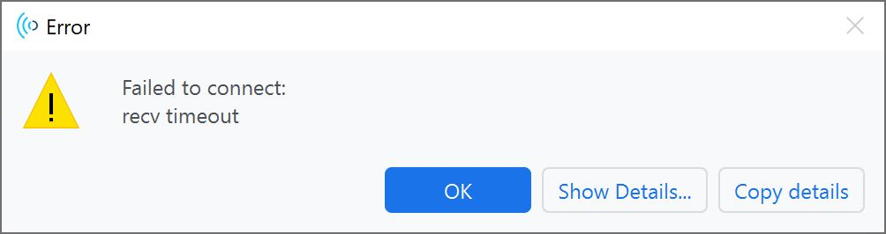
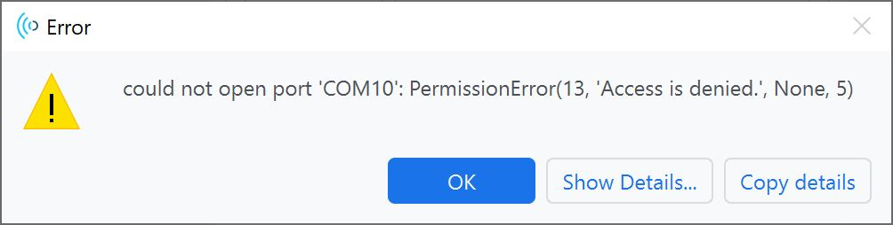
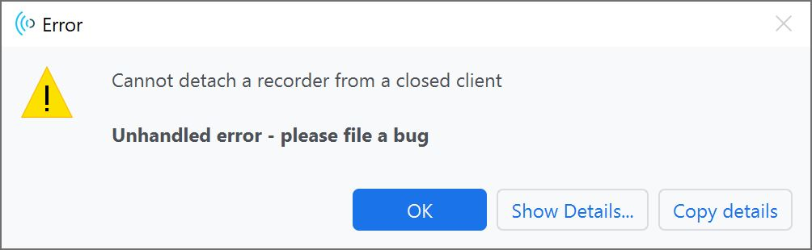

### General Troubleshooting Help

!!! note
    <span class="glyphicon glyphicon-question-sign" aria-hidden="true"></span>
        <strong> Not working as expected and need help? </strong> <br /><br />

    If you need technical assistance and more information on a product that is not working as you expected, we recommend heading on over to the <a href="https://www.sparkfun.com/technical_assistance">SparkFun Technical Assistance</a> page for some initial troubleshooting. <br /><br />

    <div style="text-align: center"><a href="https://www.sparkfun.com/technical_assistance" target="sfe_technical_assistance" class="md-button">SparkFun Technical Assistance Page</a></div>

    If you don't find what you need there, <a href="https://support.acconeer.com/support/home">Acconeer's Support Forum</a> or our <a href="https://forum.sparkfun.com/">SparkFun Forums</a> are a great place to find and ask for help. <br /><br />

    <div style="text-align: center"><a href="https://support.acconeer.com/support/home" class="md-button">Acconeer's Support Forum</a>&nbsp;&nbsp;&nbsp;<a href="https://forum.sparkfun.com/" class="md-button md-button--primary">SparkFun Forums</a></div>


### Issue Flashing Firmware

If you have problems uploading to the board, the board may not be set to Bootloader Mode. You will see the following error with flashing firmware using either the STM32CubeProgrammer.

<div style="text-align: center;">
  <table>
    <tr style="vertical-align:middle;">
     <td style="text-align: center; vertical-align: middle;"><a href="../assets/img/STM32CubeProgrammer_Error_Connecting.JPG"></a></td>
    </tr>
  </table>
</div>

For users using the Acconeer Exploration Tool, you may see the following error when flashing firmware.

<div style="text-align: center;">
  <table>
    <tr style="vertical-align:middle;">
     <td style="text-align: center; vertical-align: middle;"><a href="../assets/imgXM125_Not_in_DFU_Mode_Acconeer_Exploration_Tool_Error.JPG/"></a></td>
    </tr>
  </table>
</div>

Try checking the following before attempting to flash the board again.

- If you are using the STM32CubeProgrammer, click on the refresh button next to the COM port.
- Check that you are selecting the correct COM port.
- Unplugging and replugging the board back to your computer.
- Ensure that the CH340 drivers are installed on your computer.
- Follow the steps outlined earlier to set the board in Bootloader Mode.
- If you have the Arduino IDE also open and had connected the board to the software, make sure to close the software before connecting the XM125 to the STM32CubeProgrammer or Acconeer Exploration Tool.


### Issue 1 Connecting to the Acconeer Exploration Tool

If you receive the following error when trying to connect the XM125 to the Acconeer Exploration Tool, the problem may be due to the COM port's configuration.

``` bash
Failed to connect:
recv timeout
```

<div style="text-align: center;">
  <table>
    <tr style="vertical-align:middle;">
     <td style="text-align: center; vertical-align: middle;"><a href="../assets/img/Acconeer_Exploration_Tool_Error_Connecting_XM125_No_Baud_Rate.JPG"></a></td>
    </tr>
  </table>
</div>

When clicking on the "**Show Details...**" button, you may see the following detailed error:

``` bash
Traceback (most recent call last):
  File "C:\Users\...\portable_exploration_tool\tools\python-3.9.10-embed-amd64\lib\site-packages\acconeer\exptool\app\new\backend\_model.py", line 75, in connect_client
    self.client = client_factory()
  File "C:\Users\...\portable_exploration_tool\tools\python-3.9.10-embed-amd64\lib\site-packages\acconeer\exptool\a121\_core\communication\client.py", line 50, in open
    return super().open(
  File "C:\Users\...\portable_exploration_tool\tools\python-3.9.10-embed-amd64\lib\site-packages\acconeer\exptool\_core\communication\client.py", line 87, in open
    return subclass.open(  # type: ignore[no-any-return, attr-defined]
  File "C:\Users\...\portable_exploration_tool\tools\python-3.9.10-embed-amd64\lib\site-packages\acconeer\exptool\a121\_core\communication\exploration_client.py", line 91, in open
    return cls(client_info=client_info)
  File "C:\Users\...\portable_exploration_tool\tools\python-3.9.10-embed-amd64\lib\site-packages\acconeer\exptool\a121\_core\communication\exploration_client.py", line 115, in __init__
    self._server_info = self._retrieve_server_info()
  File "C:\Users\...\portable_exploration_tool\tools\python-3.9.10-embed-amd64\lib\site-packages\acconeer\exptool\a121\_core\communication\exploration_client.py", line 139, in _retrieve_server_info
    system_info_response = self._server_stream.wait_for_message(messages.SystemInfoResponse)
  File "C:\Users\...\portable_exploration_tool\tools\python-3.9.10-embed-amd64\lib\site-packages\acconeer\exptool\_core\communication\message_stream.py", line 64, in wait_for_message
    for message in self._stream:
  File "C:\Users\...\portable_exploration_tool\tools\python-3.9.10-embed-amd64\lib\site-packages\acconeer\exptool\_core\communication\message_stream.py", line 83, in _get_stream
    self._error_callback(e)
  File "C:\Users\...\portable_exploration_tool\tools\python-3.9.10-embed-amd64\lib\site-packages\acconeer\exptool\a121\_core\communication\exploration_client.py", line 135, in _close_before_reraise
    raise exception
  File "C:\Users\...\portable_exploration_tool\tools\python-3.9.10-embed-amd64\lib\site-packages\acconeer\exptool\_core\communication\message_stream.py", line 81, in _get_stream
    header_in_bytes = self._link.recv_until(self.protocol.end_sequence)
  File "C:\Users\...\portable_exploration_tool\tools\python-3.9.10-embed-amd64\lib\site-packages\acconeer\exptool\_core\communication\links\serial_link.py", line 155, in recv_until
    raise LinkError("recv timeout")
acconeer.exptool._core.communication.links.buffered_link.LinkError: recv timeout

During handling of the above exception, another exception occurred:

Traceback (most recent call last):
  File "C:\Users\...\portable_exploration_tool\tools\python-3.9.10-embed-amd64\lib\site-packages\acconeer\exptool\app\new\backend\_backend.py", line 161, in process_program
    model.execute_task(task)
  File "C:\Users\...\portable_exploration_tool\tools\python-3.9.10-embed-amd64\lib\site-packages\acconeer\exptool\app\new\backend\_model.py", line 51, in execute_task
    builtin_task(**kwargs)
  File "C:\Users\...\portable_exploration_tool\tools\python-3.9.10-embed-amd64\lib\site-packages\acconeer\exptool\app\new\backend\_model.py", line 87, in connect_client
    raise HandledException(msg)
acconeer.exptool.app.new._exceptions.HandledException: Failed to connect:
recv timeout
```

In this case, the COM port did not have a baud rate. Make sure to manually enter the COM port's baud rate and set it to **115200** baud.


### Issue 2 Connecting to the Acconeer Exploration Tool

If you receive the following error when trying to connect the XM125 to the Acconeer Exploration Tool, the problem might be due to another program that is already connected to the COM port.

``` bash
could not open port 'COM10': PermissionError(13, 'Access is denied.', None, 5)
```

<div style="text-align: center;">
  <table>
    <tr style="vertical-align:middle;">
     <td style="text-align: center; vertical-align: middle;"><a href="../assets/img/Acconeer_Exploration_Tool_Error_Multiple_Programs_Connecting_XM125.JPG"></a></td>
    </tr>
  </table>
</div>

When clicking on the "**Show Details...**" button, you may see the following detailed error:

``` bash
Traceback (most recent call last):
  File "C:\Users\...\portable_exploration_tool\tools\python-3.9.10-embed-amd64\lib\site-packages\acconeer\exptool\app\new\backend\_model.py", line 75, in connect_client
    self.client = client_factory()
  File "C:\Users\...\portable_exploration_tool\tools\python-3.9.10-embed-amd64\lib\site-packages\acconeer\exptool\a121\_core\communication\client.py", line 50, in open
    return super().open(
  File "C:\Users\...\portable_exploration_tool\tools\python-3.9.10-embed-amd64\lib\site-packages\acconeer\exptool\_core\communication\client.py", line 87, in open
    return subclass.open(  # type: ignore[no-any-return, attr-defined]
  File "C:\Users\...\portable_exploration_tool\tools\python-3.9.10-embed-amd64\lib\site-packages\acconeer\exptool\a121\_core\communication\exploration_client.py", line 91, in open
    return cls(client_info=client_info)
  File "C:\Users\...\portable_exploration_tool\tools\python-3.9.10-embed-amd64\lib\site-packages\acconeer\exptool\a121\_core\communication\exploration_client.py", line 107, in __init__
    (self._link, self._client_info) = ensure_connected_link(self.client_info)
  File "C:\Users\...\portable_exploration_tool\tools\python-3.9.10-embed-amd64\lib\site-packages\acconeer\exptool\_core\communication\links\helpers.py", line 101, in ensure_connected_link
    link.connect()
  File "C:\Users\...\portable_exploration_tool\tools\python-3.9.10-embed-amd64\lib\site-packages\acconeer\exptool\_core\communication\links\serial_link.py", line 118, in connect
    self._ser.open()
  File "C:\Users\...\portable_exploration_tool\tools\python-3.9.10-embed-amd64\lib\site-packages\serial\serialwin32.py", line 64, in open
    raise SerialException("could not open port {!r}: {!r}".format(self.portstr, ctypes.WinError()))
serial.serialutil.SerialException: could not open port 'COM10': PermissionError(13, 'Access is denied.', None, 5)

During handling of the above exception, another exception occurred:

Traceback (most recent call last):
  File "C:\Users\...\portable_exploration_tool\tools\python-3.9.10-embed-amd64\lib\site-packages\acconeer\exptool\app\new\backend\_backend.py", line 161, in process_program
    model.execute_task(task)
  File "C:\Users\...\portable_exploration_tool\tools\python-3.9.10-embed-amd64\lib\site-packages\acconeer\exptool\app\new\backend\_model.py", line 51, in execute_task
    builtin_task(**kwargs)
  File "C:\Users\...\portable_exploration_tool\tools\python-3.9.10-embed-amd64\lib\site-packages\acconeer\exptool\app\new\backend\_model.py", line 87, in connect_client
    raise HandledException(msg)
acconeer.exptool.app.new._exceptions.HandledException: Failed to connect:
could not open port 'COM10': PermissionError(13, 'Access is denied.', None, 5)
```

Try the checking the following before attempting to connect to the board again.

- Check that you are selecting the correct COM port.
- Unplugging and replugging the board back to your computer.
- If you have the Arduino IDE or STM32CubeProgrammer also open and had previously connected to the COM port, make sure to close the software before connecting the XM125 to the Acconeer Exploration Tool.
- Close the instance of the Acconeer Exploration Tool and restart the program.


### Issue Starting Measurements with the Acconeer Exploration Tool

If you receive the following error when trying to begin measurements with the XM125 on the Acconeer Exploration Tool, the problem may be due to the COM port's configuration.

<pre><code class="language-bash">Cannot detach a recorder from a closed client

<b>Unhandled error - please file a bug</b>
</code></pre>

<div style="text-align: center;">
  <table>
    <tr style="vertical-align:middle;">
     <td style="text-align: center; vertical-align: middle;"><a href="../assets/img/Acconeer_Exploration_Tool_Error_presence_detection_start_measurement.JPG"></a></td>
    </tr>
  </table>
</div>

When clicking on the "**Show Details...**" button, you may see the following detailed error:

```bash
Traceback (most recent call last):
  File "C:\Users\...\portable_exploration_tool\tools\python-3.9.10-embed-amd64\lib\site-packages\acconeer\exptool\_core\communication\message_stream.py", line 86, in _get_stream
    header: dict[str, t.Any] = json.loads(header_in_bytes)
  File "json\__init__.py", line 346, in loads
  File "json\decoder.py", line 340, in decode
json.decoder.JSONDecodeError: Extra data: line 1 column 14 (char 13)

During handling of the above exception, another exception occurred:

Traceback (most recent call last):
  File "C:\Users\...\portable_exploration_tool\tools\python-3.9.10-embed-amd64\lib\site-packages\acconeer\exptool\a121\algo\_plugins\_a121.py", line 176, in start_session
    self._start_session(self._recorder)
  File "C:\Users\...\portable_exploration_tool\tools\python-3.9.10-embed-amd64\lib\site-packages\acconeer\exptool\a121\algo\presence\_detector_plugin.py", line 161, in _start_session
    self._detector_instance.start(recorder)
  File "C:\Users\...\portable_exploration_tool\tools\python-3.9.10-embed-amd64\lib\site-packages\acconeer\exptool\a121\algo\presence\_detector.py", line 247, in start
    self.estimated_frame_rate = estimate_frame_rate(self.client, self.session_config)
  File "C:\Users\...\portable_exploration_tool\tools\python-3.9.10-embed-amd64\lib\site-packages\acconeer\exptool\a121\algo\_utils.py", line 446, in estimate_frame_rate
    client.stop_session()
  File "C:\Users\...\portable_exploration_tool\tools\python-3.9.10-embed-amd64\lib\site-packages\acconeer\exptool\app\new\backend\_application_client.py", line 106, in stop_session
    result = self._wrapped_client.stop_session()
  File "C:\Users\...\portable_exploration_tool\tools\python-3.9.10-embed-amd64\lib\site-packages\acconeer\exptool\a121\_core\communication\exploration_client.py", line 294, in stop_session
    _ = self._server_stream.wait_for_message(
  File "C:\Users\...\portable_exploration_tool\tools\python-3.9.10-embed-amd64\lib\site-packages\acconeer\exptool\_core\communication\message_stream.py", line 64, in wait_for_message
    for message in self._stream:
  File "C:\Users\...\portable_exploration_tool\tools\python-3.9.10-embed-amd64\lib\site-packages\acconeer\exptool\_core\communication\message_stream.py", line 88, in _get_stream
    self._error_callback(RuntimeError(f"Cannot decode header {header_in_bytes!r}"))
  File "C:\Users\...\portable_exploration_tool\tools\python-3.9.10-embed-amd64\lib\site-packages\acconeer\exptool\a121\_core\communication\exploration_client.py", line 135, in _close_before_reraise
    raise exception
RuntimeError: Cannot decode header bytearray(b'"result_info":[[{"tick":35909,"data_saturated":false,"temperature":48,"calibration_needed":false,"frame_delayed":false}]],"status":"ok","payload_size":1280}\n')

During handling of the above exception, another exception occurred:

Traceback (most recent call last):
  File "C:\Users\...\portable_exploration_tool\tools\python-3.9.10-embed-amd64\lib\site-packages\acconeer\exptool\app\new\backend\_backend.py", line 161, in process_program
    model.execute_task(task)
  File "C:\Users\...\portable_exploration_tool\tools\python-3.9.10-embed-amd64\lib\site-packages\acconeer\exptool\app\new\backend\_model.py", line 56, in execute_task
    plugin_task(**kwargs)
  File "C:\Users\...\portable_exploration_tool\tools\python-3.9.10-embed-amd64\lib\site-packages\acconeer\exptool\a121\algo\_plugins\_a121.py", line 178, in start_session
    recorder = self.client.detach_recorder()
  File "C:\Users\...\portable_exploration_tool\tools\python-3.9.10-embed-amd64\lib\site-packages\acconeer\exptool\_core\communication\client.py", line 157, in detach_recorder
    raise ClientError("Cannot detach a recorder from a closed client")
acconeer.exptool._core.communication.client.ClientError: Cannot detach a recorder from a closed client
```
This is probably due to the COM port settings (i.e. you probably selected the "Auto-connect" checkbox). You will need to close the instance of the Acconeer Exploration Tool, unplug/replug the XM125 back to your computer, and manually enter the COM port's baud rate.
